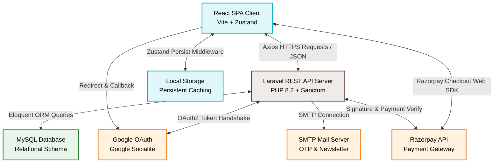
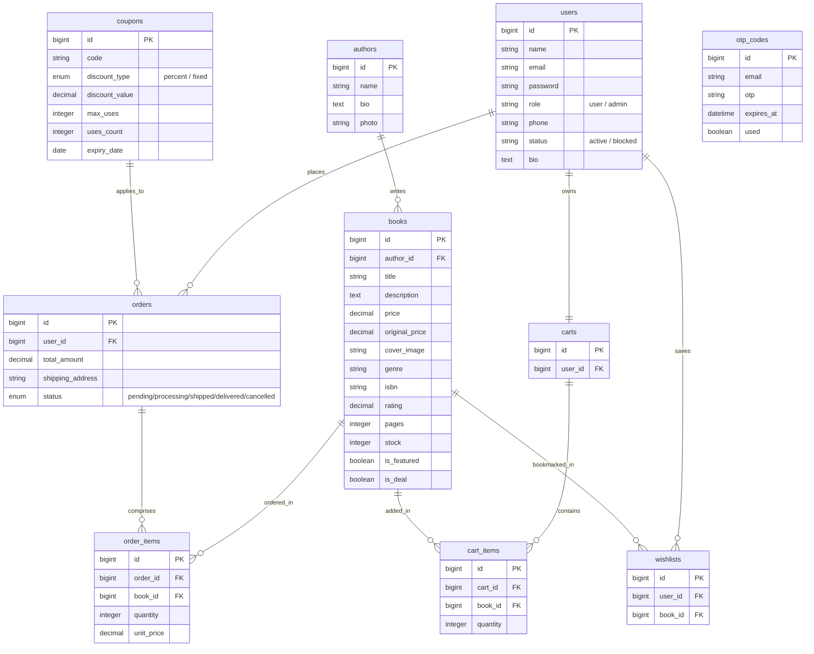

# 📚 BookVault (Haven Books) — Presentation & Technical Analysis Guide

This guide is designed to help you prepare an outstanding classroom presentation and viva examination for your **BookVault** (also branded as **Haven Books**) project. It details the system architecture, codebases, features, and database design, and concludes with a slide-by-slide PowerPoint script and viva preparation Q&A.

---

## 🏗️ 1. Project Overview & Architecture

BookVault is a premium, full-stack digital bookstore and library management system. It uses a **Decoupled Client-Server Architecture**, meaning the client-side user interface (React SPA) and the server-side API (Laravel) run independently and communicate via secure HTTP request pipelines.



### Key Architectural Benefits (Great for Slides!)
- **Separation of Concerns**: The frontend team can work on the UI/UX in React without touching backend code, and the backend team can optimize APIs independently.
- **Improved Performance**: Frontend files are static HTML/JS/CSS, which can be served globally from CDNs (like Vercel) in milliseconds. The Laravel API is optimized to output JSON payloads quickly.
- **Enhanced Security**: The database is completely hidden behind the Laravel security firewall (middleware, Sanctum auth, input validators). No direct access is exposed.
- **Client Offline-First Feeling**: Zustand stores (cart, wishlist) persist in browser local storage. If a user reloads the browser, their cart and session do not disappear.

---

## 🛠️ 2. Detailed Tech Stack Breakdown

### Frontend (haven-books)
- **Vite 5.4**: Sub-second hot-module replacement (HMR) and optimized rollup-based production builds.
- **React 18.3**: Single Page Application (SPA) architecture utilizing reusable custom components.
- **Zustand 5.0**: Lightweight state engine that replaces complex Redux boilerplate. Combined with `persist` middleware to sync client state directly into the browser's `localStorage`.
- **Tailwind CSS 3.4**: Clean styling architecture utilizing curated literary palettes (warm cream backgrounds, forest greens, coral highlights, and full dark-mode integration).
- **Framer Motion 12.38**: Orchestrates 3D perspective animations, smooth page-to-page state translations, and custom mathematical particle physics on interactive hover events.

### Backend (backend/bookStoreBackend)
- **Laravel 12.0 (PHP 8.2+)**: Modern, high-efficiency REST API framework utilizing MVC structure.
- **Laravel Sanctum**: Secure token-based session management using stateful API cookie authentication and bearer token verification.
- **Laravel Socialite**: Handles Google OAuth 2.0 redirection, certificate validation, and user profile retrieval.
- **Razorpay PHP SDK**: Backend transaction integrity manager. Handles payment generation, capturing, and cryptographic HMAC signature validation.
- **Nginx & Docker**: Optimized multi-stage Docker configurations utilizing an Alpine Linux base image to package Nginx and PHP-FPM together in a tiny footprint.

---

## 🗄️ 3. Relational Database Schema & Models

The database consists of **12 core tables** mapping out the bookstore's domains, orders, authentication tokens, and logs.



---

## 💡 4. Deep Dive: Key Technical Workflows

### 🛡️ Feature A: Secure OTP Authentication (Registration Shield)
To avoid bot creation and verify emails during user sign-up:
1. **Frontend Request**: The React Client collects details and hits `POST /api/otp/send`.
2. **OTP Generation**: The backend invalidates previous tokens and generates a secure random 6-digit number using PHP's cryptographically secure pseudo-random number generator (`random_int(100000, 999999)`).
3. **Database Logging**: The token is saved in `otp_codes` with a `created_at` timestamp and an `expires_at` window set to `Carbon::now()->addMinutes(10)`.
4. **Email Dispatch**: An email is dispatched via SMTP containing dynamic HTML layout blocks representing the digits.
5. **Verification**: The user enters the code. React hits `POST /api/otp/verify`. Laravel validates the code is unexpired, matches the email, and hasn't been `used` before marking it as active.

---

### 💳 Feature B: Razorpay E-Commerce Payment Pipeline
To verify online payments securely and avoid card transaction spoofing:

```
[React Cart] ──(items/coupon)──> [Laravel API] ──(Create Order ID)──> [Razorpay SDK]
                                       │                                   │
                                 (JSON Payload)                     (Order Created)
                                       ▼                                   ▼
[Show Checkout UI] <─────────── (OrderID / Key) <──────────────────────────┘
       │
 (Collect Payment)
       ▼
[Verify Signature] ──(Signature/PaymentID)─> [verifyPaymentSignature()] ──> [Success DB Commit]
                                                                            - Save Order/Items
                                                                            - Decrement Inventory
                                                                            - Clear Active Cart
```

1. **Order Initiation**:
   - React client submits shopping cart items and coupon details to `POST /api/razorpay/order`.
   - Laravel looks up book prices in the database (ignoring any values sent directly from the client to prevent price manipulation), checks inventory, and calculates discounts.
   - Laravel uses the **Razorpay PHP SDK** to request an Order ID for the calculated sum.
   - The Order ID is sent back to React.
2. **Payment Checkout**:
   - The React client opens the official Razorpay Checkout window in the browser, showing the total.
   - The user completes payment using mock cards/UPI. Razorpay generates a signature containing the `razorpay_order_id`, `razorpay_payment_id`, and a HMAC signature.
3. **Signature Verification**:
   - React sends these tokens to Laravel's callback URL: `POST /api/razorpay/verify`.
   - Laravel verifies the HMAC signature using the locally stored secret key. If valid, the payment is captured.
   - An Order is generated in the database, book inventory is decremented, the cart is cleared, and success is returned.

---

### 🎨 Feature C: Interactive 3D Physics 404 Page (Framer Motion Showcase)
This is an aesthetic highlight of the project located in [NotFound.jsx](file:///c:/Users/hp/Desktop/BOOK%20MANAGEMENT%20SYSTEM/haven-books/src/pages/NotFound.jsx):
- **3D Card Hover Physics**: Inside a perspective box wrapper, two animated pages (left page and right page) use custom spring-based 3D rotations on hover. When the cursor approaches the book, the pages tilt on the Y-axis (`rotateY: -22` and `rotateY: 22` respectively) utilizing Framer Motion's springs.
- **Particle System**: An active particle component (`FloatingLetters`) releases dynamic characters (`A`, `z`, `?`, `📚`, `B`, `o`, `k`) from the center. Each character rises upwards and outwards using distinct custom translation paths, scaling offsets, and delayed execution timers.

---

## 📊 5. Slide-by-Slide PowerPoint Outline

Here is the exact slide layout you should use to build your presentation, including speaker notes for what to say out loud.

---

### Slide 1: Title Slide (The Hook)
- **Visuals**: Large central title: **BookVault (Haven Books)**. A subtitle: *"Premium Full-Stack Digital Library & Bookstore Management System"*. Include your name (Aditya Kumar) as the author/presenter. Use a warm cream or sleek charcoal background mock-up of the homepage.
- **Bullet Points**:
  - Decoupled client-server architecture
  - Secure REST API integration
  - Rich interactive aesthetics (Playfair Display + Framer Motion)
  - Production-ready e-commerce capabilities
- **Speaker Notes**:
  > *"Good morning, everyone and respected teacher. Today, I am excited to present my project, 'BookVault'—also known as 'Haven Books'. BookVault is a modern, high-performance, full-stack digital library and bookstore application. Unlike standard e-commerce projects, BookVault was built from the ground up focusing on premium typography, secure multi-factor authentication, and verified real-time payments. Let me walk you through how it works."*

---

### Slide 2: Project Architecture
- **Visuals**: Use the **Architecture Diagram** shown in Section 1. Clearly separate the React SPA on the left from the Laravel API on the right, connecting them with arrows representing JSON requests.
- **Bullet Points**:
  - **Decoupled Architecture**: Front-end and back-end are fully independent.
  - **Client SPA**: React 18 running on Vite.
  - **API Backend**: Laravel 12 API acting as the security and business logic manager.
  - **Storage**: Zustand persistent state engine + MySQL database.
- **Speaker Notes**:
  > *"At the core of BookVault is a decoupled client-server architecture. The frontend React application acts as a Single Page Application (SPA), which compiles to static assets. It communicates with our Laravel backend using Axios HTTP requests. By separating the user interface from our database and business logic, we achieve better security, faster load speeds, and easier maintenance."*

---

### Slide 3: Frontend Tech Stack & Zustand Caching
- **Visuals**: Logos/Badges of React, Vite, Tailwind CSS, and Zustand.
- **Bullet Points**:
  - Built with **React 18.3** and compiled with **Vite 5.4** for blazing fast performance.
  - Styled with **Tailwind CSS** using a custom cream-palette design.
  - State management handled by **Zustand**.
  - **Local Persistence**: Cart data, wishlists, and sessions are cached locally using Zustand's persist middleware, ensuring zero loss on page refresh.
- **Speaker Notes**:
  > *"On the frontend, we use React combined with Vite. For styling, we created a custom palette using Tailwind CSS to give a luxurious, literary feel. For state management, we avoided the high complexity of Redux and used Zustand. One of our key features here is client state persistence. By utilizing Zustand's persist middleware, shopping carts, wishlist selections, and authentication tokens are cached automatically in local storage, which makes the app feel incredibly fast and responsive."*

---

### Slide 4: Backend API & Sanctum Security
- **Visuals**: Logos of Laravel, PHP, and MySQL. A code snippet showing the API route grouping with `auth:sanctum` middleware.
- **Bullet Points**:
  - Powered by **Laravel 12.0** and **PHP 8.2+**.
  - Session security handled by **Laravel Sanctum** token verification.
  - Custom **Admin Middleware** blocks unauthorized requests to critical models.
  - Full relational mapping using MySQL and Eloquent ORM.
- **Speaker Notes**:
  > *"The backend is built using Laravel. To secure the endpoints, we implement Laravel Sanctum. When a user logs in, the API returns a stateful bearer token. This token must accompany every subsequent request to modify carts, view libraries, or make payments. We also have a custom Admin Middleware that ensures only administrators can CRUD books, manage user accounts, or generate coupons."*

---

### Slide 5: Database Schema
- **Visuals**: Show the **Entity-Relationship Diagram** from Section 3. Highlight relationships like User-Cart (1-to-1) and User-Orders (1-to-many).
- **Bullet Points**:
  - Fully normalized database running **MySQL 8.0**.
  - Models: Users, Books, Authors, Carts, CartItems, Wishlists, Orders, OrderItems, Coupons, OTPs.
  - Cascading deletes ensure data integrity (e.g., deleting a cart removes its items).
  - Database seeders to populate book datasets directly.
- **Speaker Notes**:
  > *"Our database schema is designed for data integrity. We have tables mapping users, books, authors, carts, orders, and coupons. We use Eloquent ORM relationships. For example, a User 'hasOne' Cart, which 'hasMany' CartItems. An Order 'hasMany' OrderItems. We also configured foreign key constraints with cascading deletes so that if a cart is deleted or cleared, its items are automatically cleaned up in the database."*

---

### Slide 6: Secure OTP Registration Flow
- **Visuals**: Flow diagram showing: *Register Submit ➔ Generate OTP (Laravel) ➔ Send Email (SMTP) ➔ Verify OTP ➔ Activate Account*.
- **Bullet Points**:
  - Secure registration verified through real-time OTP confirmation.
  - Random 6-digit code generated cryptographically via PHP `random_int`.
  - Expiry set to 10 minutes; automatically invalidated on use.
  - SMTP mail configuration integration for sending custom transactional emails.
- **Speaker Notes**:
  > *"To ensure that user accounts are verified, we implemented a custom passwordless OTP email verification flow. When registering, a 6-digit random code is generated by our OtpController and stored in the database with a 10-minute expiry time. We then dispatch a professionally styled HTML transaction email via SMTP. Once the user enters the code and verifies it, their account registration completes securely."*

---

### Slide 7: Google OAuth 2.0 Integration
- **Visuals**: A screenshot of the "Sign in with Google" button and a diagram of the Socialite redirect callbacks.
- **Bullet Points**:
  - Integrated via **Laravel Socialite**.
  - Stateless OAuth flow to exchange authorization codes.
  - Checks if user exists; creates a secure record automatically if new.
  - Generates Sanctum Token and returns it to the client.
- **Speaker Notes**:
  > *"For modern ease of access, we integrated third-party Google OAuth login. Clicking 'Sign in with Google' redirects the browser to Google's authentication page. Upon consent, Google redirects to our backend callback. Laravel Socialite processes the token, fetches the user's name and email, and matches them to our database. If it's a new user, an account is created instantly. The backend then issues a Sanctum token and redirects the browser back to our React dashboard."*

---

### Slide 8: Razorpay Payments & Integrity Check
- **Visuals**: The **Razorpay Payment Pipeline diagram** from Section 4.
- **Bullet Points**:
  - Secure purchase checkouts with server-side validation.
  - Prevents price injection: total calculated dynamically on backend.
  - Cryptographic verification via Razorpay utility `verifyPaymentSignature`.
  - Atomically updates stocks and clears carts on payment success.
- **Speaker Notes**:
  > *"For payments, we integrated the Razorpay API. To prevent malicious users from modifying book prices in the browser's javascript, we perform all calculations on the server side. The frontend sends the book IDs, and the Laravel backend checks the database prices to generate a secure Razorpay Order ID. Once payment completes, the frontend sends the signatures, which are verified on the server using HMAC. On successful signature verification, the books' inventory stocks are decremented, and the order is finalized."*

---

### Slide 9: Admin Dashboard & Control
- **Visuals**: Screenshots of the Admin Dashboard showing list of books, user toggle-status, and coupons CRUD.
- **Bullet Points**:
  - Rich admin panels to CRUD books and authors.
  - Toggle block/unblock status of registered users.
  - Create and manage coupons with usage limits and expiry dates.
  - Track order lists and modify shipping status.
- **Speaker Notes**:
  > *"BookVault features a comprehensive Admin Dashboard. From this portal, admins can manage the entire catalog: adding, editing, or deleting books and author profiles. They can view all registered users and toggle their account status between 'active' and 'blocked'. Furthermore, admins can manage the promotional coupon campaigns, specifying expiry dates, coupon types, and usage limits."*

---

### Slide 10: Conclusion & Core Takeaways
- **Visuals**: Contact info slide (Github link, LinkedIn, etc.) from the README.
- **Bullet Points**:
  - Seamless modern e-commerce experience.
  - Robust security using Sanctum, Middleware, and HMAC signature checks.
  - Highly optimized frontend utilizing Vite, Zustand state caches, and Framer Motion transitions.
  - Docker containerization ready for easy cloud deployment.
- **Speaker Notes**:
  > *"In conclusion, BookVault successfully demonstrates how React and Laravel can be combined to build an enterprise-level e-commerce system. By emphasizing separate architectures, database integrity, payment security, and premium user experience aesthetics, this project represents a production-ready template. Thank you so much for your time. I am open to any questions you may have."*

---

## 🙋‍♂️ 6. Viva / Q&A Preparation Questions

Your teachers will test your core programming understanding during the presentation. Here are the most common questions they might ask about this specific code setup, and how you should answer.

### Q1: What is Middleware, and where is it used in your project?
*   **Concept**: Middleware is a filter that intercepts incoming HTTP requests before they reach your controller (or responses before they leave).
*   **Your Project Answer**:
    > *"In BookVault, we use middleware for security. First, we use Laravel's default `auth:sanctum` middleware to protect routes like `/api/cart`, `/api/orders`, and `/api/wishlist`—ensuring only authenticated users can access them. Second, we created a custom `AdminMiddleware` inside `app/Http/Middleware` that checks the authenticated user's role. If the role is not 'admin', the request is blocked with a 403 Forbidden status, protecting admin APIs like `/api/books` (POST/PUT/DELETE) and `/api/users`."*

### Q2: How did you handle payments securely? What if a user modifies the price in Chrome Developer Tools?
*   **Concept**: Client-side data is completely untrusted. All monetary calculations must happen on the server.
*   **Your Project Answer**:
    > *"To prevent price tampering, we do NOT trust the price sent by the client. The frontend only sends the Book ID and the Quantity. The backend `RazorpayController` queries the actual book prices directly from our MySQL database, calculates the total, applies any valid coupon discount, and then creates the order directly with the Razorpay API. Additionally, we verify the transaction signature on the backend using Razorpay's HMAC signature verification utility. This ensures the payment was genuinely completed for the correct amount before writing the order to the database."*

### Q3: Why did you choose Zustand instead of Redux for frontend state management?
*   **Concept**: Redux requires a large amount of boilerplate code (actions, reducers, store configuration) and can slow down rendering if not optimized. Zustand is hook-based, lightweight, and fast.
*   **Your Project Answer**:
    > *"We chose Zustand because it is lightweight, has a very simple hook-based API, and is highly performant. Unlike Redux, it doesn't require boilerplate files like actions and reducers. Furthermore, Zustand provides built-in support for persist middleware, allowing us to cache our cart, wishlist, and user session states into the browser's local storage with just a single line of code. This ensures user data is preserved even when they reload the page."*

### Q4: What is Google Socialite, and how does your Google login work?
*   **Concept**: Laravel Socialite simplifies OAuth 2.0 authentication by managing the handshake redirect and user retrieval.
*   **Your Project Answer**:
    > *"Laravel Socialite is a package that manages OAuth 2.0 flows with third-party providers like Google. When a user clicks 'Login with Google', Socialite redirects them to Google's consent screen. Once approved, Google redirects back to our callback route with an authorization code. Socialite exchanges this code for the user's details statelessly. If the user doesn't exist in our database, we create a record with a secure, randomly generated password, log them in, issue a Sanctum token, and redirect them back to the React application."*

### Q5: What is the difference between a Database Seeder and a Factory?
*   **Concept**: Seeders are used to insert specific, known records into the database. Factories are used to generate random, fake data for testing.
*   **Your Project Answer**:
    > *"We use **Seeders** (like `BookSeeder.php`) to insert the actual, production-ready catalog data—such as our core book titles, author profiles, and prices—into the database. **Factories** are used to generate thousands of records of dummy data using libraries like Faker, which is extremely helpful for database stress-testing and automated unit tests. For our presentation, running the seeder populates the website with real book titles and images."*

### Q6: What is CORS, and why did you have to configure it?
*   **Concept**: Cross-Origin Resource Sharing (CORS) is a browser security mechanism that blocks a webpage on one domain from making API requests to another domain.
*   **Your Project Answer**:
    > *"Since our project uses a decoupled architecture, our React client runs on one port (e.g., `localhost:5173`) and our Laravel backend runs on another (e.g., `localhost:8000`). By default, web browsers block requests across different origins. We configured the CORS configuration file in Laravel (`config/cors.php`) to explicitly whitelist our frontend URLs. This allows the React client to make HTTP calls (like fetching books or logging in) to the backend API without being blocked by the browser."*

### Q7: Why are you using MySQL migrations instead of manually creating tables in phpMyAdmin?
*   **Concept**: Migrations are version control for your database, allowing the team to synchronize database schemas automatically.
*   **Your Project Answer**:
    > *"MySQL migrations act as version control for our database schema. Instead of manually creating tables using SQL commands in phpMyAdmin, we write the table structures in PHP files inside our code. This guarantees that anyone running the project can create the exact same database structure, with all foreign keys, indexes, and columns, simply by running the `php artisan migrate` command. This prevents mismatch errors between teammates."*
